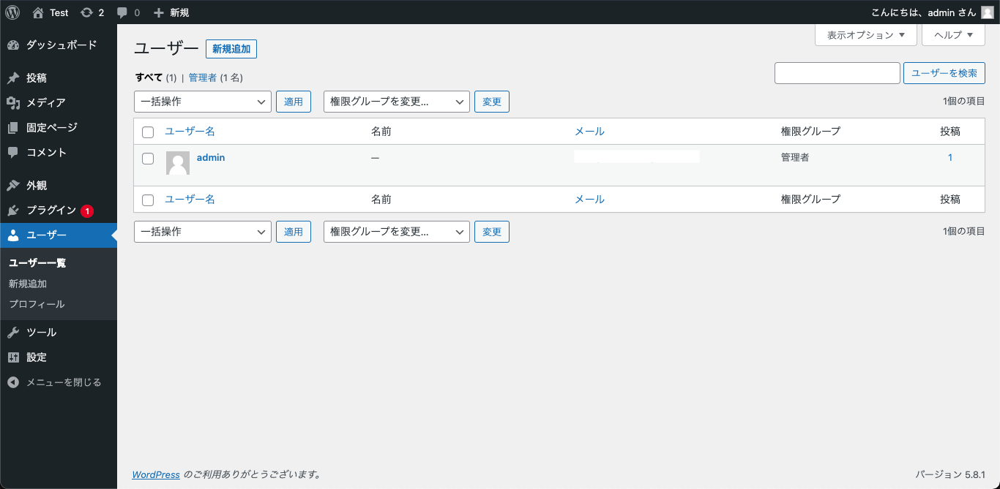
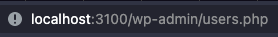
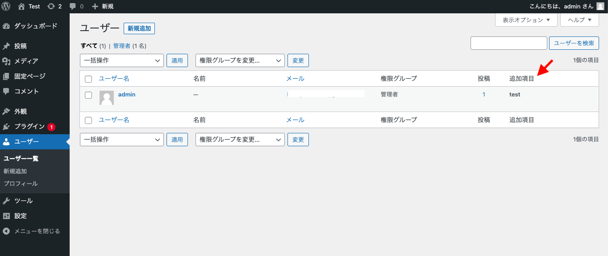

# 本記事について
  
Wordpressのカスタマイズ技術の習得を目的とした記事です。
Wordpress自体はある程度触ったことがあり、  
何らかのカスタマイズをしようとしている開発者を対象者としてます。  
  
* [第一回](lesson_1.md)    

# 今回のお題

管理画面のユーザー一覧に列を追加してみます。    



# urlから対象ファイルを特定する

まずは、どこのソースを見ていけばよいのかあたりをつけていきます。  
ブラウザのURLを見ると、このようにでているので  
  
そのまんま、  
```wp-admin/users.php```を見てみます。  

# user.phpを見てみる

```
<hr class="wp-header-end">

		<?php $wp_list_table->views(); ?>

<form method="get">

		<?php $wp_list_table->search_box( __( 'Search Users' ), 'user' ); ?>

		<?php if ( ! empty( $_REQUEST['role'] ) ) { ?>
<input type="hidden" name="role" value="<?php echo esc_attr( $_REQUEST['role'] ); ?>" />
<?php } ?>

		<?php $wp_list_table->display(); ?>
</form>

<div class="clear"></div>
</div>
		<?php
		break;

} // End of the $doaction switch.

require_once ABSPATH . 'wp-admin/admin-footer.php';
```

PHPファイルの中では日本語は使われてないので探しづらいです。  
下にスクロールして行くと「User Search」という文字列があります。  
__(  )はよくある多言語用の関数なので、  
ここが「ユーザーを検索」になるのでしょう。  
ですから、その下が一覧を作っているところですね。  

そういう風に見ると、  
```<?php $wp_list_table->display(); ?>```  
が気になります。  
```$wp_list_table```が何者かと言うと・・・
  
```
$wp_list_table = _get_list_table( 'WP_Users_List_Table' );
```  
  
更に```_get_list_table```を見ていくと、
```wp-admin/includes/list-table.php```に辿り着きます。  
  
```
function _get_list_table( $class, $args = array() ) {
	$core_classes = array(
		// Site Admin.
		'WP_Posts_List_Table'                         => 'posts',
		'WP_Media_List_Table'                         => 'media',
		'WP_Terms_List_Table'                         => 'terms',
		'WP_Users_List_Table'                         => 'users',
		'WP_Comments_List_Table'                      => 'comments',
		'WP_Post_Comments_List_Table'                 => array( 'comments', 'post-comments' ),
		'WP_Links_List_Table'                         => 'links',
		'WP_Plugin_Install_List_Table'                => 'plugin-install',
		'WP_Themes_List_Table'                        => 'themes',
		'WP_Theme_Install_List_Table'                 => array( 'themes', 'theme-install' ),
		'WP_Plugins_List_Table'                       => 'plugins',
		'WP_Application_Passwords_List_Table'         => 'application-passwords',

		// Network Admin.
		'WP_MS_Sites_List_Table'                      => 'ms-sites',
		'WP_MS_Users_List_Table'                      => 'ms-users',
		'WP_MS_Themes_List_Table'                     => 'ms-themes',

		// Privacy requests tables.
		'WP_Privacy_Data_Export_Requests_List_Table'  => 'privacy-data-export-requests',
		'WP_Privacy_Data_Removal_Requests_List_Table' => 'privacy-data-removal-requests',
	);

	if ( isset( $core_classes[ $class ] ) ) {
		foreach ( (array) $core_classes[ $class ] as $required ) {
			require_once ABSPATH . 'wp-admin/includes/class-wp-' . $required . '-list-table.php';
		}

		if ( isset( $args['screen'] ) ) {
			$args['screen'] = convert_to_screen( $args['screen'] );
		} elseif ( isset( $GLOBALS['hook_suffix'] ) ) {
			$args['screen'] = get_current_screen();
		} else {
			$args['screen'] = null;
		}

		return new $class( $args );
	}

	return false;
}  
```  
  
user.phpの  
```
$wp_list_table = _get_list_table( 'WP_Users_List_Table' );
```    

list-table.phpの_get_list_tableの  
```  
'WP_Users_List_Table'                         => 'users',  
```      
```  
require_once ABSPATH . 'wp-admin/includes/class-wp-' . $required . '-list-table.php';  
```  
以上を合わせると、  
```wp-admin/includes/class-wp-users-list-table.php```
がロードされて、WP_Users_List_Tableクラスが呼ばれてると思われます。  
  
# WP_Users_List_Tableクラスからフックを探す
  
というわけで、
```wp-admin/includes/class-wp-users-list-table.php```
を見てみると、  
```  
class WP_Users_List_Table extends WP_List_Table {  
```  
WP_Users_List_Tableクラスがありました。  
クラス名とファイル名は合わせてくださいよと思いますが・・・。  

[第一回](lesson_1.md)で覚えた、  
do_action・apply_filtersを探してみるとそれっぽいのが見つかります。  
  
```  
/**
	* Filters the display output of custom columns in the Users list table.
	*
	* @since 2.8.0
	*
	* @param string $output      Custom column output. Default empty.
	* @param string $column_name Column name.
	* @param int    $user_id     ID of the currently-listed user.
	*/
$r .= apply_filters( 'manage_users_custom_column', '', $column_name, $user_object->ID );

```  
  
早速これにカスタマイズを入れてみます。    
  
## フックにメソッドを追加する  

functions.phpにメソッドを追加します。  
  
```  
/**
 * @param string $output      Custom column output. Default empty.
 * @param string $column_name Column name.
 * @param int    $user_id     ID of the currently-listed user.
 * @return string
 */
function lesson_users_custom_column($output, $column_name, $user_id) {
	return '<b>test</b>';
}

add_filter('manage_users_custom_column', 'lesson_users_custom_column', 10 ,3);

// ヘッダ追加
// かなり深くソース追わないと見つけられないフックなので今回は説明をスキップします・・・
function lesson_users_custom_header( $columns ) {
	$columns['extra'] = '追加項目';
	return $columns;
}
add_filter( 'manage_users_columns', 'lesson_users_custom_header' );    
```
  
```manage_users_custom_column```はフィルターフックですね。  
出力（＝戻り値）があるのでアクションではなくフィルターです。  
フックの部分のコメントなどを読んで、```add_filter```には下記のようにまとめます。  
  
  * タグ＝```manage_users_custom_column```  
  * メソッド名  
  * 優先度は何でもOK（今の所このタグで、メソッドを追加してる箇所がなさそうだから）
  * フックの説明文に引数が３つ書いてあるので引数の数を3  

```  
add_filter('manage_users_custom_column', 'lesson_users_custom_column', 10 ,3);
```    
  
戻り値は説明がないですが、流れから行って文字列かHTMLですよね。  
これで一覧のデータ部には列が追加できます。  
  
が、データ部だけ追加しただけでは列は増えません。    
ヘッダの方も項目を増やすよう何かしてあげなけれなばなりません。  
しかし、ヘッダの項目追加はソースを追う方法だとかなり見つけづらいので、今回は説明をスキップします。  
取り急ぎ、```manage_users_columns```を使うと思ってください。      
      
ちょっと中途半端ですが```manage_users_custom_column```さえ見つければ、  
これをキーワードに検索すれば「ユーザー一覧への項目追加方法」みたいなブログ記事がHITしますので・・・  
一部でもヒントを見つければそれをヒントに検索かけるのはありだと思います。  


  
今回はここまでです。  
  
# 今後の予定  
  
今回ユーザー一覧に追加項目を出しましたが、まだ固定文字列が出ています。  
特に要望がなければ、今後は  
  
* ユーザー情報に独自項目を追加し、ユーザー編集画面でメンテ可能にする  
* 独自項目をユーザー一覧に表示する  
  
という感じで進めていきます。  
  
# 【補足】ソース解析とエディタの設定について  
  
ソースを追う際、多くのエディタで右クリックメニューなどで、  
関数やクラスに飛ぶことができますが、  
Wordpressのソースはエディタの設定によっては飛べません。  
これは、WordpressはPHP標準の設定だとエディタがうまく解析できないからです。  
（下手するとコンパイルエラーでソースが真っ赤になる可能性もあります。）  
WordpressにはWordpressにあったエディタの設定があるので、それはまた別途説明します。  
ただ・・・Visual Studio Codeしか説明できないとは思います。  
他のエディタについては各々頑張ってください。