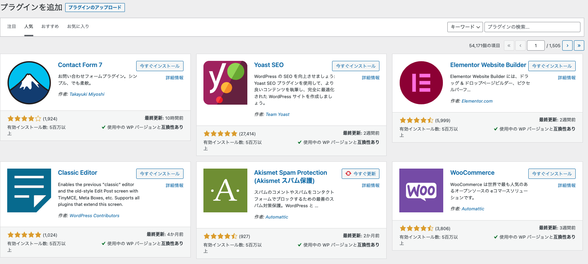
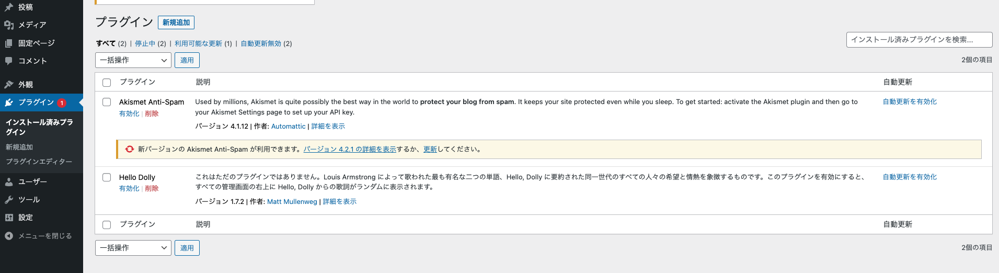
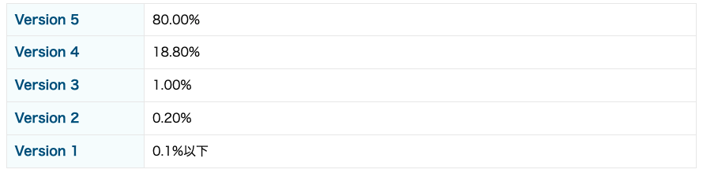
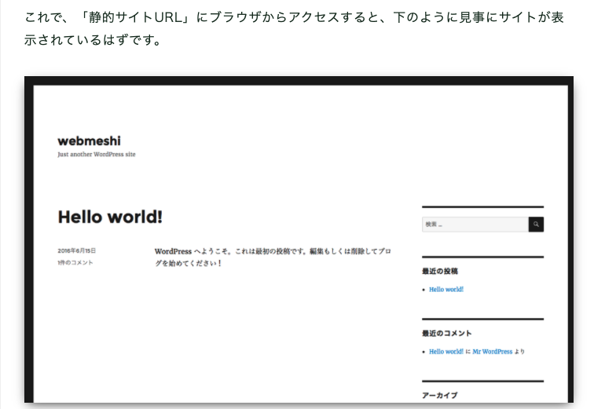

# 今回のアジェンダ

* プラグインついてのおさらい
* StaticPressの紹介
* 新企画

# プラグインとは

* Wordpressの機能を拡張するプログラムです。
* Wordpressの公式プラグインとそうでないものがあります。  
  Wordpressの管理画面から検索できるものが公式、  
  どこかのHPからDLしかできなかったりするものが非公式です。
* プラグインの中にはブログとはかけ離れた機能をを提供するものもあります。
  故に、なんでもできる！と錯覚してしまうこともあります。

# プラグインの導入方法

管理画面から検索、インストールします。  
基本的に検索でHITするのは現在の最新版です。  
故に、プラグインを見つけても「対応してない」と出ることもあります。  
→Wordpress本体が古過ぎても新しすぎてもにこの状況になり得ます。  

使用しているプラグインに新しいバージョンが出た場合は画面に出るので、  
適度なタイミングでアップデートします。  

ただし、アップデートをしてしまうと元のバージョンに戻すのは至難の業なので注意です。  

# プラグインの相性について  
  
プラグインには相性があります。    
しかし、相性については各プラグインの開発者は責任を負いません。  
故に、複数のプラグインを導入する場合は使う側が検証しないといけません。    
  
例えば、
Wordpressnに問い合わせフォームを追加する有名なプラグイン’Contact Form 7には、  
確認画面を追加する別のプラグインが存在します。  

しかし、Contact Form 7の開発者は自身のプラグインの仕様変更により、  
確認画面を追加するプラグインが動作しなくなることについて質問されても困ると発言しています。  

このあたりの話は、Wordpressのバージョンアップの際に問題になりがちです。  
バージョンアップしたいけど○○の更新がストップしている！のような感じです。  

# プラグインがバージョンアップできない場合はどうする？

結論でてません（汗）  

プラグインがWordpressのバージョンアップで困るケースには以下のようなものがあります。

1. プラグインが新しいWordpressのバージョンアップに対応していない
2. プラグインが有料化してしまった。
3. プラグインの更新が止まっている。

1についてはとりあえず待てばいいと思いのですが、
3は困りますね。
2も現実問題として結構困ります。

# Wordpressはバージョンアップしないといけないのか？

[出典](https://www.trevo-web.com/staffdiary/cms202007wordpress.html)

比率を見るとある程度頑張ってついていかないとダメそうです。  
古いバージョンのWordpressは狙われそうですね。

# StaticPressの紹介

[参考記事](https://webfood.info/staticpress-s3/#StaticPress123983537323450124341237712427)
StaticPressとは記事を静的HTML化し、  
AWSのS3に置くようにして速度改善させよう！というプラグインです。  
静的HTMLなので、Wordpress本体のバージョンアップが多少遅れても問題はありません。  
単なるHTMLなのでセキュリティ対策もばっちりです。  
ここまでの話した様々の課題の一つの解決策のように思えます。  

しかし、どうやらこのプラグインでできあがる静的HTMLは、  
完全にWordpressとは別サイトになるようです。  
となると、動的なコンテンツ・ログイン・問い合わせフォームがどうするのか？  
という問題が生じします。  
URLの設計にテクニックが要りそうです。  

# 新企画

というわけで、プラグインは便利だけど長く付き合うためにはノウハウを溜めないといけないという話になります。  
（個人の感想です。）  

一方で、自分達に都合の良いプラグインを育てることも要るのでは？ということで  

取り急ぎ独自の「施設予約プラグイン」を作ってみます。  

このテーマを選ぶのは数名の方からこれに似たテーマで相談を受けたからです。  
・・・とは言え、いきなり実用レベルは難しいので  
「デモができるレベル」を「今年度末まで」を目標とします。  
今後の当勉強会はこれをテーマに進めていこうと思います。  
